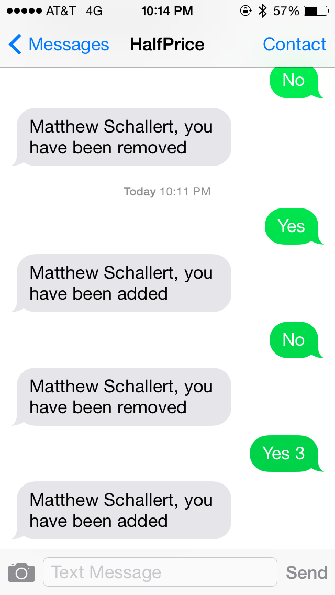
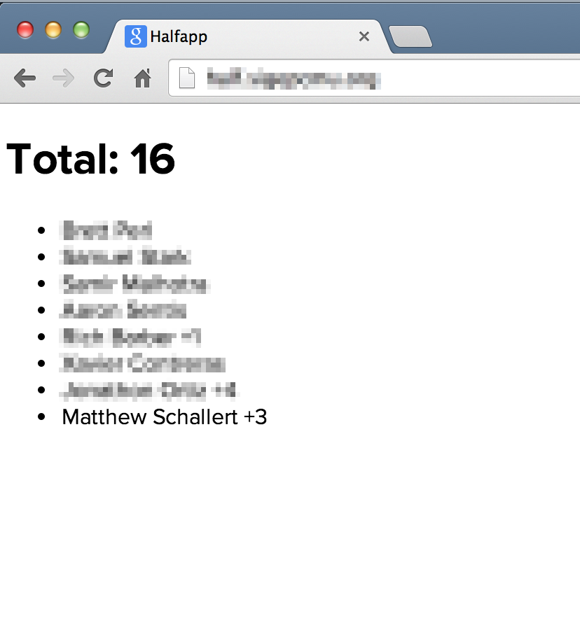

# HalfApp

"Half price" is a sacred tradition in Oakland, Pittsburgh (near CMU) where every night a few restaurants offer their menu at (surprise!) half price. However in order to guarantee a spot in half price, you have to be there a half an hour early knowing the *exact* number of people in your party.

Every Sunday night a lot of members of my fraternity head to half price. We have one person who's in charge of coordinating it all, and in the past they would have to manually keep track of who had texted them saying they were going, who was bringing guests, who had cancelled, etc. It was all a huge headache!

Since I have a love of creating cool useful things to solve problems, I saw an opportunity to solve the headache that was coordinating half price. So I made this app!

The way it works is this:

1. If you're going to half price, you text the half price number "yes". Bringing guests? Awesome! Just send "yes 1", "yes 2", etc.
2. If you can no longer go, just text "no" to remove yourself from the list.
3. The person in charge of half price can easily see who's coming and how many people to put in a reservation for!

Some pictures of the app in use are below:

